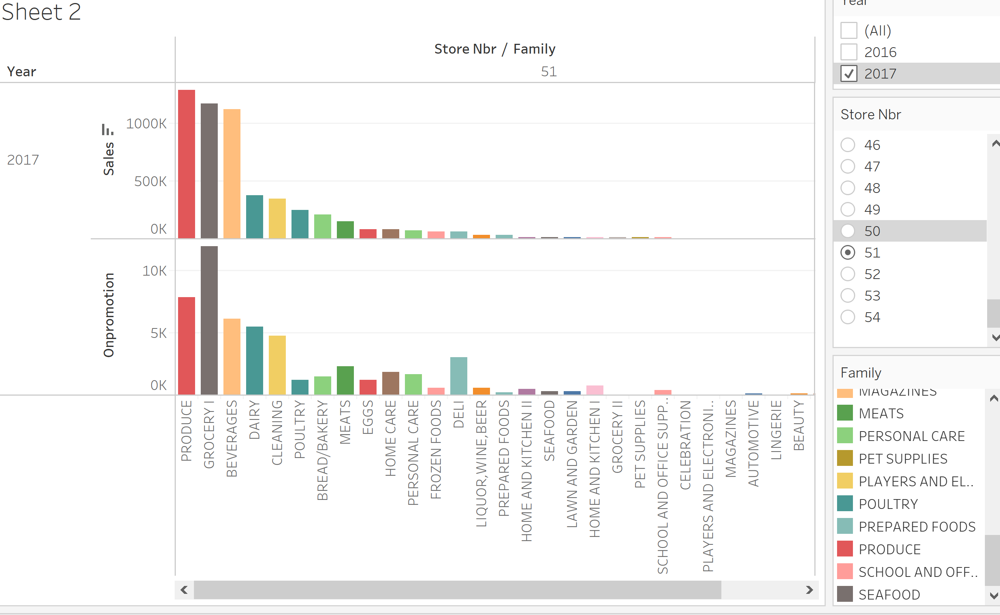

```{r setup, include=FALSE}
knitr::opts_chunk$set(
  fig.retina=3,
  echo = TRUE,
  eval = TRUE,
  warning = FALSE,
  message = FALSE
  )
```

# 1.0 Introduction

The data set chosen for this project consist of time series data from series of Favorita department stores located in Ecuador found [here](https://www.kaggle.com/c/store-sales-time-series-forecasting). The focus of this project will be to develop an interactive visual analysis app that would allow the manager of the chain department stores to analyze the sales data for different stores, evaluate the strength of signals from different factors and time series performance of different stores to make an informed decision with regards to operations of the stores.

# 2.0 Motivation

Data for transactions at convenience stores or eCommerce websites are freely available online for students and analysts to practice their analysis skills to derive insights. However, analysis and visualization often focus on presenting static insights or the development of models for customer analytics. Skills required for such analysis may take some deep learning of technical skills. While there are general graphic interface-based tools this may be out of reach or still require some technical skills to be effective.

In this project we wish to demonstrate how a customized R Shiny application would allow users without deep technical capabilities to perform similar technical analysis to draw their own insights with regards to operational decision of their outlets.

# 3.0 Project Objectives

This project hopes to address 3 issues. The first as mentioned in the previous section, regarding static results from analysis. This project hopes to provide an interactive platform for individuals to derive their own insights.

In addition, we hope to incorporate statistical analysis in an interactive format such that users can derive and verified strength of certain observations.

Lastly, we wish to make use of time series visualization techniques such as cyclic plots and horizon plots to allow users to derive their patterns and trends from time series data. 

# 4.0 Proposed Scope and Methodology

Prior to building the app the first step would be to do background research on the data to have a thorough understanding and possibilities with the data set. Followed by drafting and idea generation of possible visualizations that would meet required analytical purpose. For this project some of the subtask identified are:

**Categorical Exploratory Analysis**:

* Visualize transactions or sales across different categorical variables.
*	Across stores, states, and product categories.
 
**Statistical Analysis**:

*	Verify strength of differences between groups. 
*	Differences in terms of sales for product categories, stores, or locations. 
 
**Time series visualization**: 

*	Time series visualization of data. 
*	Product category sales across time periods. 
*	Store or state sales across time periods. 
*	Visualize effect of holidays on sale numbers 

Project schedule is as follows:


# 5.0 Storyboard and Visualisation Features

**Exploratory Analysis**: 

Bar charts could be used for exploration of sales by different categorical attributes: 

- for each store, display the sales and number of promotions for each product type.
- user can choose to which store to inspect, and which year.



- Sales information could also be presented by city level


- Sales for each category of product could be display across all the stores.
- User can choose which product to display and time range.


**Statistical Analysis of attributes**:

- For statistical analysis boxplot of sales as shown by the picture displayed below could be used.
- users can choose the type of statistical test for the graph and the statistical outcome will be displayed together with the graph to verify findings from exploratory analysis.
- users can choose to choose other categorical variable such store type or store cluster.
- users can also select the time range of sales data.


**Time Series Visualization**:

To visualize different time series trends:

- horizon plot for sales across time could be used.
- user can choose whether to display the sales by city, state, or product category and the date range of data to display to visualize seasonality of products or overtime trend of sales across stores and cities.


- Through line charts of sales where user can choose the store ID, the user could check the sales overtime for each store over a date range.
- Corresponding day of the week cyclic plot could be used to display purchasing trends on different days on the week.


- Similar chart could be generated for product categories. Where overtime trends of each product category is show and their weekly trends.


# 6.0 R Packages

The following R packages are expected to be used for this project:

*	shiny: https://shiny.rstudio.com
*	shinythemes: https://cran.r-project.org/web/packages/shinythemes
*	tidyverse: https://www.tidyverse.org
*	plotly: https://cran.r-project.org/web/packages/plotly
*	corrplot: https://cran.r-project.org/web/packages/corrplot
*	DT: https://cran.r-project.org/web/packages/DT
*	ggHoriPlot: https://rivasiker.github.io/ggHoriPlot/index.html


# 8.0 Team Members

* He Qiyun
* Ting Yen-Hsin
* Ng Jianyuan Caine

# 9.0 References

Dataset: https://www.kaggle.com/c/store-sales-time-series-forecasting/data


