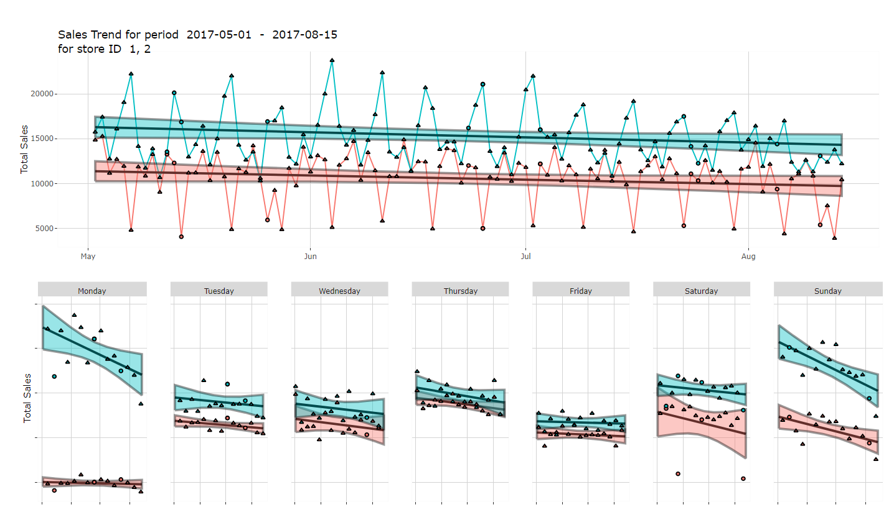

```{r setup, include=FALSE}
knitr::opts_chunk$set(
  fig.retina=3,
  echo = TRUE,
  eval = TRUE,
  warning = FALSE,
  message = FALSE
  )
```

# 1.0 Introduction

The data set chosen for this project consist of time series data from series of Favorita department stores located in Ecuador found [here](https://www.kaggle.com/c/store-sales-time-series-forecasting). The focus of this project will be to develop an interactive visual analysis app that would allow the manager of the chain department stores to perform a time series analysis on store sales and group attributes based on time series patterns before further inspecting the data along generated groups.

# 2.0 Motivation

Data for transactions at convenience stores or eCommerce websites are freely available online for students and analysts to practice their analysis skills to derive insights. A common approach is to use unsupervised learning techniques such as k-means clustering or hierarchical clustering to group data together before further analyzing the groups for the unique traits. However possibility due to complexity or requirement for specialized enterprise software clustering of time series data is seldom done.

The availability of R package dtwclust has allowed access to perform time series clustering without significant cost. However does require some familiarity with R code to access functions in the packages.

In this project we wish to demonstrate how a customized R Shiny application would allow users without deep technical capabilities to perform analysis on their time series data to group different attributes along their time series data before further analysis into their group characteristics.


# 3.0 Project Objectives

This project aims to enable users of the app to perform a overview time series analysis, before grouping the data followed by analysis of the different groups.

To start, we wish to make use of time series visualization techniques such as horizon plots to allow users to observe, compare patterns and trends from time series data along different attributes and data ranges.

Next based on observations users could perform clustering using time series data. Using interactive drop down menus to configure various settings to performing the clustering. 
Finally allow users to inspect results of the data along specific characteristics of the groups. For instance if group is done along geographic locations, maps would be displayed where the location of the groups are or for categorical attributes the sales values and contribution to total sales.

In addition, we hope to incorporate other visualizations to explore the data such as overlay multiple time series for viewing and their relevant cyclic plots. Also statistical analysis in an interactive format such that users can derive and verified strength of certain observations.


# 4.0 Proposed Scope and Methodology

Prior to building the app the first step would be to do background research on the data to have a thorough understanding and possibilities with the data set. Followed by drafting and idea generation of possible visualizations that would meet required analytical purpose. For this project some of the sub task identified are:

**Time Series Visualizations**:

* Visualize the time series data such that users could compare sales values across time along different categorical attributes.
 
**Time Series Clustering**:

*	Application of time series dtw package in an interactive format for the scope of the data. 
*	Return results for user to inspect and adjust model is necessary.
* Relevant visualization such at users could inspect model results.
 
**Results and data inspection**: 

*	Appropriate data visualizations such that users could further analyise generated clusters. 
*	Sales amount for members of various groups. 
*	Geographic location is grouping along geographic factors. 
*	Overlay of time series data for specific data points. 

Project schedule is as follows:


# 5.0 Storyboard and Visualisation Features


**Time Series Visualization - Horizon plot**:

To start a horizon plot could be generated. Horizon plot allows for comparison of large number of categorical levels to for quick viewing of differences and seasonal trends.

- user could choose whether to display the sales either by city, state, or product category and the date range of data to visualize seasonality of products or overtime trend of sales across stores and cities.


**Time Series Clustering**:

Based on earlier results from above the user could then choose to perform time series clustering. 

- The user could choose group the time series data along different categorical level available in the data such as state, cities or product categories.
- Various settings for configuring the model would also be available. 
- Appropriate visualization of the results such as time series line graph for partitional clustering of each group could be return for user to inspect correctness of the model.


- For hierarchical clustering a dendrogram would be returned.


**Results Dashboard**:

Based on grouping generated the user could then inspect the groups to deep dive into similarities in the groups.

- Time series line chart of the original data would be return such that user could look into the trends.
- Boxplot of sales among members of the group would be displayed.
- If clustering is perform along a geographic attribute, then a map and location of the groups would be displayed.


**Time Series Results Deep Dive**:

Lastly the user could return to the data through time-series line graphs and day of the week cyclic plots to deep dive into specific trends

- Different from earlier chart at this part user could choose specific categorical levels to overlay on top of each other to see their similarities.



Below are additional visualizations proposed explore the data further.


**Exploratory Analysis**: 

Bar charts could be used for exploration of sales by different categorical attributes: 

- for each store, display the sales and number of promotions for each product type.
- user can choose to which store to inspect, and which year.


- Sales information could also be presented by city level


- Sales for each category of product could be display across all the stores.
- User can choose which product to display and time range.


**Statistical Analysis of attributes**:

- For statistical analysis boxplot of sales as shown by the picture displayed below could be used.
- users could choose the type of statistical test for the graph and the statistical outcome will be displayed together with the graph to verify findings from exploratory analysis.
- users could choose to choose other categorical variable such store type or store cluster.
- users could also select the time range of sales data.


# 6.0 R Packages

The following R packages are expected to be used for this project:

*	shiny: https://shiny.rstudio.com
*	shinythemes: https://cran.r-project.org/web/packages/shinythemes
*	tidyverse: https://www.tidyverse.org
*	plotly: https://cran.r-project.org/web/packages/plotly
*	corrplot: https://cran.r-project.org/web/packages/corrplot
*	DT: https://cran.r-project.org/web/packages/DT
*	ggHoriPlot: https://rivasiker.github.io/ggHoriPlot/index.html
* dtwclust: https://github.com/asardaes/dtwclust
* lubridate:https://lubridate.tidyverse.org/
* ggstatsplot: https://indrajeetpatil.github.io/ggstatsplot/
* tmap: https://r-tmap.github.io/tmap/
* ggmosaic: https://haleyjeppson.github.io/ggmosaic/
* treemapify: https://r-charts.com/part-whole/treemapify/


# 8.0 Team Members

* He Qiyun
* Ting Yen-Hsin
* Ng Jianyuan Caine

# 9.0 References

* Dataset: https://www.kaggle.com/c/store-sales-time-series-forecasting/data
* Dtwclust - Time Series Clustering Package: https://github.com/asardaes/dtwclust
* Samples using package (DTW) - https://damien-datasci-blog.netlify.app/post/time-series-clustering-with-dynamic-time-warp/
* Sample Clustering with traffic data: https://samstehle.github.io/TrafficClustering.html


